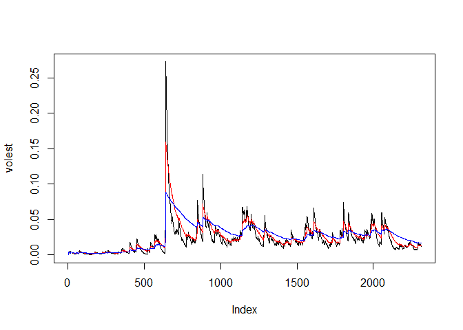

# CO Stock Analysis
Sharon Teo  
July 17, 2016  

# Library required

```r
library(tseries)
```

# Download CO stock data 

```r
COdata <- get.hist.quote('CO',quote="Close")
```

```
## time series starts 2007-05-09
## time series ends   2016-07-15
```

# Length of CO data

```r
length(COdata)
```

```
## [1] 2314
```

# Calculate CO return using log

```r
COret <- log(lag(COdata))-log(COdata)
```

# Length of CO log return

```r
length(COret)
```

```
## [1] 2313
```

# Calculate volatility of S&P in 250 trading days 

```r
COvol <- sd(COret) * sqrt(250) * 100
COvol
```

```
## [1] 49.81642
```

# Volatility function

```r
vol <- function(d,logrets){
  var=0
  lam=0
  varlist <- c()
  for (r in logrets) {
      lam = lam*(1 - 1/d) + 1
  var = (1 - 1/lam)*var + (1/lam)*r^2
        varlist <- c(varlist, var)
  }
  sqrt(varlist)
}
```
# Calculate volatility over entire length of series for various three different decay factors.

```r
volest <- vol(10, COret)
volest2 <- vol(30, COret)
volest3 <- vol(100, COret)
```

# Plot the results, overlaying the volatility curves on the data


```r
plot(volest, type="l")
lines(volest2, type="l",col="red")
lines(volest3, type="l",col="blue")
```

<!-- -->
